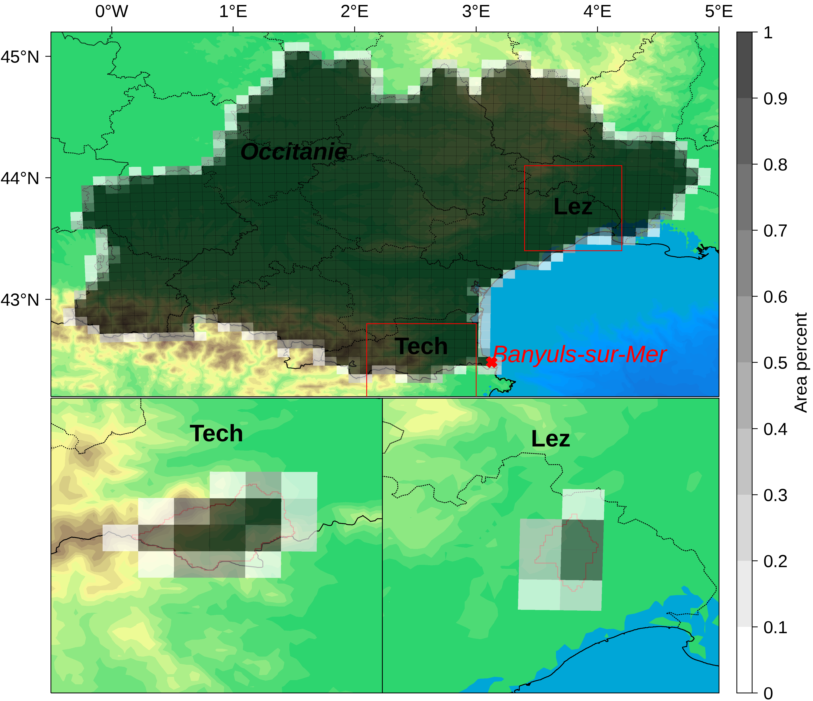

# Introduction

Le but de ce TP sera d'appliquer quelques méthodes de correction de biais à des modèles climatiques. Les données corrigées seront utilisés dans les TPs suivants pour la modélisation hydro.

Nous proposons dans ce TP de corriger les modèles suivants:

| gcm               | rcm           | run    | scenario   |
|:------------------|:--------------|:-------|:-----------|
| IPSL-IPSL-CM5A-MR | IPSL-WRF381P  | r1i1p1 | historical |
|                   |               |        | rcp45      |
|                   |               |        | rcp85      |
| MOHC-HadGEM2-ES   | ICTP-RegCM4-6 | r1i1p1 | historical |
|                   |               |        | rcp85      |

De ces modèles ont été extraits les séries moyennes sur les deux zones (Lez et Tech) représentées sur la figure suivante:



Les cases et la colorbar associées représentent la portion de chaque point de grille interceptant les bassins Tech et Lez, les séries des modèles et des observations SAFRAN ont été calculés avec une moyenne pondéré par ces valeurs.

Commencons par quelques rappels théorique. Les données univariées d'un modèle seront notés $X$, et les multivariées $\mathbf{X}$. De la même manière, la référence (SAFRAN) et la correction seront notée $Y$ et $\mathbf{Y}$; et $Z$ et $\mathbf{Z}$. Dans un contexte de calibration (resp. projection), les variables seront notés $X^0$, $Y^0$ et $Z^0$ (resp. $X^1$, $Y^1$ et $Z^1$). Algorithmiquement, ces variables seront notés `X0`, `X1`, `Y0`, `Z0` et `Z1`.

À chacune de ces variables est attachées sa *distribution de probabilité*, qui sera notée $\mathbb{P}_\mathbf{X}$. Dans le cas univarié, nous utiliserons aussi la *fonction de répartition* (CDF), définie par:

$$F_X(x) := \mathbb{P}_X( X \leq x ).$$

Son inverse $F_X^{-1}$ se nomme la *fonction quantile*.

Une fonction $\mathcal{T}$ est une méthode de *correction de biais* de $\mathbf{X}$ par rapport à $\mathbf{Y}$ si la distribution de probabilité de $\mathbf{Z}$ est $\mathbb{P}_\mathbf{Y}$, i.e. si elle transforme la distribution de probabilité de $\mathbf{X}$ en celle de $\mathbf{Y}$. Formellement, cela se traduit par les hypothèses:

$$
\left\{
\begin{aligned}
\mathbf{Z} &= \mathcal{T}(\mathbf{X}) \\
\mathbb{P}_\mathbf{Z} &= \mathbb{P}_\mathbf{Y} = \mathcal{T}(\mathbb{P}_\mathbf{X})
\end{aligned}
\right.
$$

Une méthode sera dite *stationnaire* si elle ne prend pas en compte un changement dans la distribution du modèle. À l'inverse les méthodes en tenant compte seront qualifiés de *non-stationnaires*.

Une méthode sera dite *univarié* si elle est uniquement capable de corriger les distributions marginales d'un modèle $\mathbf{X}$, i.e. si elle ne peut que corriger indépendamment chacune des composantes $\mathbf{X}=(X_1,\dots,X_N)$. Une méthode capable de tenir compte de la dépendance entre les différentes composantes est qualifiée de *multivariée*.

Avant de rentrer dans le vif du TP, faisons quelques réglages.

------------------------------------------------------------------------

# Quelques réglages

## Packages

Commencons par charger les deux packages suivants (sources disponibles en suivant les url): - [ROOPSD](https://github.com/yrobink/ROOPSD): un package pour estimer des distributions de probabilités (*R Object Oriented Programming for Statistical Distribution*) - [SBCK](https://github.com/yrobink/SBCK): le package qui contient les méthodes de corrections de biais (*Statistical Bias Correction Kit*)

```{r}
library(ROOPSD)
library(SBCK)
```

Normalement vous devriez avoir dans votre repertoire un fichier `ETP.R` que nous allons charger. Si ce n'est pas le cas, modifiez le chemin d'accès en conséquence.

```{r}
source("src_ETP.R")
```

## Le `print`

En `R`, la fonction couramment utilisée pour afficher des résultats est le `print`. Cette fonction coupe par défaut la sortie à 80 caractères et renvoit à la ligne les suivants. La fonction suivante permet d'étendre cette limite à 300 caractères:

```{r}
#base::options( width = 300 )
```

Si le résultat ne vous convient pas (où que vous avez un écran trop petit), n'hésitez pas à changer la valeur.

## Chemin vers les données

Le chemin d'accès vers les données d'entrée sera contenu dans la variable `ipath`, à modifier en fonction de l'endroit où vous avez mis les données sur votre ordinateur. Normalement le repertoire `ipath` doit contenir les repertoires `CORDEX` et `SAFRAN`.

Un exemple est mis ici. Lorsque ce TP a été écrit, les données étaient dans un sous repertoire `data` du repertoire contenant le notebook. La commande `getwd` permet de récupérer le repertoire courant du notebook, que l'on concatène avec `"data"` en utilisant la fonction `file.path`. Notez que cette fonction `file.path` permet de joindre des chemins sans se soucier de savoir si le séparateur est un `/` (UNIX-like) ou un `\` (windows).

```{r}
ipath = file.path( getwd() , "data" )
```

## Fonction d'extraction des données

Ici sont réunis les fonctions pour extraires les données:

-   `SI2human_units`: cette fonction transforme les unités. (K -\> °C, kg/m2/s -\> mm / jour),
-   `read_observations`: cette fonction permet de relire les données SAFRAN,
-   `read_models`: cette fonction permet de relire les données des modèles,
-   `extract_period`: cette fonction permet de sélectionner une saison et une sous période de temps.

```{r}
SI2human_units = function(X)
{
	for( v in list("tas","tasmin","tasmax") )
		X[,v] = X[,v] - 273.15
	
	X[,"prtot"] = 86400 * X[,"prtot"]
	
	return(X)
}
```

```{r}
## zone: 'Lez' ou 'Tech'
## ipath: chemin d'accès
read_observations = function( zone , ipath )
{
	ifile = paste0("SAFRAN_",zone,".csv")
	Y     = read.csv( file.path( ipath , "SAFRAN" , ifile ) , header = TRUE , row.names = 1 )
	Y     = as.matrix(Y)
	return( SI2human_units(Y) )
}
```

```{r}
## gcm: identifiant gcm (voir le tableau de l'introduction)
## rcm: identifiant rcm (voir le tableau de l'introduction)
## run: identifiant du run (voir le tableau de l'introduction)
## scenario: le scénario
## zone: 'Lez' ou 'Tech'
## ipath: chemin d'accès
read_models = function( gcm , rcm , run , scenario , zone , ipath )
{
	ifileh = paste0( paste( gcm , rcm , run , "historical" , zone , sep = "_" ) , ".csv" )
	ifilef = paste0( paste( gcm , rcm , run , scenario     , zone , sep = "_" ) , ".csv" )
	
	Xh = read.csv( file.path( ipath , "CORDEX" , ifileh ) , header = TRUE , row.names = 1 )
	Xf = read.csv( file.path( ipath , "CORDEX" , ifilef ) , header = TRUE , row.names = 1 )
	Xh = as.matrix(Xh)
	Xf = as.matrix(Xf)
	
	X  = rbind(Xh,Xf)
	
	return(SI2human_units(X))
}
```

```{r}
## data: données d'entrée
## seas: la saison choisie, 'JJA', 'DJF', 'MAM' ou 'SON'
## period: un vecteur de deux années
extract_period = function( data , seas , period )
{
	## Build period
	t0 = base::paste( as.integer(period[1]) - 1 , "11" , "30" , sep = "-" )
	t1 = base::paste( as.integer(period[2])     , "12" , "01" , sep = "-" )
	
	## Transform seas to numbers
	mseas = list(
			"MAM" = base::c("03","04","05"),
			"JJA" = base::c("06","07","08"),
			"SON" = base::c("09","10","11"),
			"DJF" = base::c("12","01","02")
			)
	
	## Extract period
	odata = subset( data  , (t0 < row.names(data)) & (row.names(data) < t1) & (format.Date( row.names(data) , "%m" ) %in% mseas[[seas]]) )
	
	return(odata)
}
```

## Fonctions pour les corrections

Deux fonctions sont données dans cette section:

-   `copy_attrs`: les méthodes de correction de SBCK retire les noms de lignes / colonnes des données, cette fonction permet de les rétablir,
-   `postprocessing`: comme nous le verrons, après une correction certaines étapes supplémentaires peuvent s'avérer necessaires. C'est le role de cette fonction qui implémente un choix possible.
-   `nb_cluster_0`: fonction qui calcule le nombre de cluster de 0 d'une taille donnée.

```{r}
copy_attrs = function( Z , X )
{
	colnames(Z) = colnames(X)
	rownames(Z) = rownames(X)
	return(Z)
}
```

```{r}
postprocessing = function( Z , X )
{
	## Temperature
	## => Just reorder tas / tasmin / tasmax
	idx = base::c(2,1,3)
	Z[,idx] = base::t( apply( Z[,idx] , 1 , sort ) )
	
	## Precipitation
	## All values < 0.1mm/day are equal to 0
	th = 0.1 / 86400
	Z[ Z[,6] < th,6] = 0
	
	## sfcWind and huss: remove negative values
	for( i in 4:5 )
	{
		idx = Z[,i] < 0
		if( base::any(idx) )
			Z[idx,i] = 0
	}
	
	Z = copy_attrs(Z,X)
	
	return(Z)
}
```

```{r}
## X: série temporelle des pluies
## n_day: calcule le nombre de cluster de taille 1, 2, 3, ... n_day
nb_cluster_0 = function( X , n_day )
{
	nb = numeric(n_day+1)
	
	for( i in 1:(n_day+1) )
	{
		Xm    = !( apply( matrix( toeplitz(X)[,1:i] , ncol = i ) , 1 , max ) > 1e-3 )
		nb[i] = sum(rle(Xm)$values)
		if( i > 1 )
			nb[i-1] = nb[i-1] - nb[i]
	}
	return(nb[-(n_day+1)])
}
```

## Pour vous aider...

Dans ce TP, vous serez amener à calculer plusieurs fois des biais, afficher des densités, etc. Comme ces algorithmes vont souvent revenir, il sera de bon ton d'en faire des fonctions réutilisables. Au cas où le temps nous manquerait (ou que vous auriez des difficultés de programmations), elle sont disponibles dans le fichier `correction_function.R`:

```{r}
source("src_correction_function.R")
```

Ce fichier contient les fonctions suivantes:

-   `basic_bias(X,Y,lZ=NULL)` Prend `X`, `Y` et optionnellement une liste de correction `lZ` pour afficher les biais.
-   `plot_density(X,Y,Z=NULL)` Affiche les densités de `X`, `Z` et optionnellement d'une correction `Z`.
-   `delta_projection(X0,X1,lZ0,lZ1)` Affiche les écarts entre les deux périodes.
-   `plot_projection_density(X0,Y0,X1,lZ1)` Affiche les densités,
-   `plot_density_ETP(etpX0,etpY0,letpZ0)` Affiche les densités des ETP
-   `corr_bias(X0,Y0,lZ0=NULL,relatif=FALSE)` Affiche les biais des corrections (en relatif ou non)

------------------------------------------------------------------------

# Exploration des données

Nous proposons de faire une première fois ce TP sur la zone *Tech*, en se restreignant aux étés. Nous prendrons comme période calibration 1976 / 2005, et comme période de projection 2070 / 2099. Initialisons donc les variables correspondantes:

```{r}
zone  = "Tech"
seas  = "JJA"
calib = base::c(1976,2005)
proj  = base::c(2070,2099)
```

Nous travaillerons aussi avec le modèle *IPSL-IPSL-CM5A-MR / IPSL-WRF381*, scénario *rcp85*:

```{r}
gcm      = "IPSL-IPSL-CM5A-MR"
rcm      = "IPSL-WRF381P"
run      = "r1i1p1"
scenario = "rcp85"
```

## Les observations

**Problème** Charger les données d'observations dans une variable `Y` à l'aide de la fonction `read_observations`, et utiliser la fonction `extract_period` ainsi que les variables précédentes pour construire les observations en période de calibration `Y0`.

```{r}

```

## Le modèle à corriger

**Problème** Charger les données modèles dans une variable `X` à l'aide de la fonction `read_models`, et utiliser la fonction `extract_period` ainsi que les variables précédentes pour construire le modèle en période de calibration `X0` et projection `X1`.

```{r}

```

## Format des données

Les données `Y0`, `X0` et `X1` sont des matrices où les lignes sont l'axe du temps, et les variables sont en colonnes. Vous pouvez ainsi accéder directement à une ligne / colonne particulière avec la syntaxe suivante:

-   `Y0[,"tas"]`: Affiche la colonne contenant la température moyenne.
-   `Y0["1976-01-01",]`: Affiche toutes les variables le 1er janvier 1976.

**Problème** Affichez les noms des lignes et colonnes avec les fonctions `colnames` et `rownames`.

```{r}

```

## Quels biais ?

**Problème 1** Sur la période de calibration, examiner la différence entre `Y0` et `X0` en moyenne (fonction `mean`), en écart type (fonction `sd`) ainsi que pour quelques niveaux de quantiles (fonction `quantile`). Exprimez les biais en différence brute, et en relatif.

**Problème 2** Faire 6 figures, chacune affichant les densités de `Y0` et `X0` de chaque variables. Fonction utiles: `plot`, `lines`, `density`, `new_figure`. Dans la fonction `density`, attention au paramètre `bw` (pour *bandwidth*) qui peut différer d'un jeu de donnée à un autre.

***Tips*** Vu que nous allons sans cesse examiner des biais, il peut être utile de transformer les deux étapes précédentes en fonctions que vous pourrez appeler à la demande. Pour la correction j'ai par exemple construit la fonction `basic_bias( X , Y , lZ = NULL)` qui affiche les biais entre `Y` et `X`, et si la liste des corrections `lZ` n'est pas `NULL`, les biais entre `Y` et les éléments de `lZ`. J'ai fait de même pour les densités avec une fonction `plot_density( X , Y , Z = NULL )`.

```{r}

```

```{r,fig.height=6,fig.width=9,fig.dpi=600}

```

------------------------------------------------------------------------

# Le quantile mapping

## Éléments théorique

La première méthode que nous allons voir est le *quantile mapping* (HADDAD et ROSENFELD, 1997), qui est univarié et stationnaire. L'hypothèse de cette méthode est que la valeur $x\in X$ admet la correction $y\in Y$ si elles ont le même niveau de quantile. Autrement dit, si:

$$F_X(x)=F_Y(y).$$

Sous l'hypothèse que $F_Y$ est inversible, on en déduit directement la fonction de correction $\mathcal{T}$:

$$\mathcal{T} = F_Y^{-1}\circ F_X.$$

Cette méthode a l'avantage d'être facile à implémenter et numériquement rapide. Bien qu'elle ne tienne pas compte de la structure de dépendance de $Y$, elle reproduit celle de $X$ sur $Z$. Son inconvénient étant qu'elle est stationnaire, et peut donc difficilement corriger les projections climatiques.

## Correction

Le package `SCBK` implémente plusieurs méthodes stationnaires (i.e. capable de corriger en période calibration). Elles s'appellent toutes sur le modèle suivant:

``` r
bcm = SBCK::QM$new() ## Initialisation de la méthode, avec ses paramètres potentiels (ici aucun)
bcm$fit( Y0 , X0 )   ## Construction de la fonction de correction entre X0 et Y0
Z0 = bcm$predict(X0) ## Correction de X0
```

**Problème** Corrigez `X0` et `X1` à l'aide de la méthode `SBCK::QM`. Utilisez ensuite la fonction `postprocessing`.

```{r}

```

## Biais résiduels en calibration

**Problème** À l'aide des algorithmes développés à la section précédente, comparez les biais des données corrigées et des données d'origines.

```{r}

```

```{r,fig.height=6,fig.width=9,fig.dpi=600}

```

## Et la période de projection ?

**Problème 1** Pour les statistiques précédemment étudiées, comparez la différence `X1` et `X0` et la différence `Z1` et `Z0`. Par exemple, vous pouvez regarder les deux indicateurs suivants:

$$ \mathbb{E}(\mathbf{X}^1) - \mathbb{E}(\mathbf{X}^0) $$ $$ \frac{\mathbb{E}(\mathbf{X}^1) - \mathbb{E}(\mathbf{X}^0)}{\mathbb{E}(\mathbf{X}^0)} $$

**Problème 2** De la même manière, affichez les densités de `X0`, `X1`, `Z0` et `Z1`.

```{r}

```

```{r,fig.height=6,fig.width=9,fig.dpi=600}

```

## Résumé

Le quantile mapping est donc une méthode capable de corriger les variables en période de calibration, mais la correction en période de projection reste bloquée aux valeurs *déja observées*. Donc par exemple, un changement comme le changement climatique risque d'être sous estimé avec cette méthode.

------------------------------------------------------------------------

# La méthode CDF-$t$

## Éléments théorique

L'hypothèse de CDF-$t$ est de supposer que la transformation de $Y^0$ vers $Y^1$ (les potentielles observations futures) est la même que celle de $X^0$ vers $X^1$, i.e. on veut que *la correction des projections suivent la même dynamique que celle du modèle*. À l'aide du quantile mapping, la transformation de $X^0$ vers $X^1$ (et idem pour $Y^0$ et $Y^1$) est donnée par:

$$F^{-1}_{X^1}\circ F_{X^0} $$

L'hypothèse de CDF-$t$ s'écrit donc:

$$ F^{-1}_{Y^1}\circ F_{Y^0} = F^{-1}_{X^1}\circ F_{X^0} $$

En recombinant les deux cotés de l'équation, nous trouvons:

$$ F_{Y^1} = F_{Y^0} \circ F^{-1}_{X^0} \circ F_{X^1} $$

Ceci nous donne comme fonction de correction:

$$\mathcal{T}=\left(F_{Y^0} \circ F^{-1}_{X^0} \circ F_{X^1}\right)^{-1}\circ F_{X^1}.$$

Notons que cette fonction est cohérente: si on remplace $X^1$ par $X^0$ nous retombons bien sur le quantile mapping.

## Correction

La méthode CDF-$t$ fait partie des méthodes non-stationnaires, sa syntaxe d'utilisation est donc légèrement différente:

``` r
bcm = SBCK::CDFt$new()
bcm$fit( Y0 , X0 , X1 )
Z  = bcm$predict(X1,X0)
Z0 = Z$Z0
Z1 = Z$Z1
```

**Problème** Corriger `X0` et `X1` à l'aide de CDF-$t$.

```{r}

```

## Biais résiduels en calibration

**Problème** Comparez les biais des données corrigées et des données d'origines.

```{r}

```

## Et la période de projection ?

**Problème** Reproduisez l'analyse de la section précédente, et comparer la aux résultats du quantile mapping.

```{r}

```

```{r,fig.height=6,fig.width=9,fig.dpi=600}

```

## Calcul des ETPs

Nous allons maintenant calculer l'évapotranspiration potentielle (*ETP* en Francais, *evspsblpot* en convention MIP). C'est une variable très importante en hydrologie, et dont le calcul dépend de (dans le contexte de ce TP, plusieurs estimateurs existent):

-   La température minimale (tasmin)
-   La température maximale (tasmax)
-   Le vent moyen (sfcWind)
-   L'humidité spécifique (huss)

**Problème** À l'aide la fonction `find_ETP` du fichier `ETP.R` (qui a normalement déja été chargé au début de ce TP avec la fonction `source`), calculez les ETPs de `Y0`, `X0`, et des différentes corrections `Z0`. Comparez les.

```{r}

```

```{r,fig.height=6,fig.width=6,fig.dpi=600}

```

## La structure de dépendance

### Intuition de la structure de dépendance

Le problème pour le biais des ETPs vient de la structure de dépendance qui n'est pas corrigé par la méthode CDF-$t$. Pour développer une intuition de cette structure, nous proposons d'examiner la structure entre `tas` et `tasmin` de `Y0`. La syntaxe suivante permet de construire une variable aléatoire `rvY0TM` disposant d'un générateur:

``` r
rvY0TM = ROOPSD::rv_histogram$new()$fit(Y0[,1])
Y0TMu  = rvY0TM$rvs(1000)
```

**Problème 1** En vous inspirant du code précédent, générez deux séries aléatoires selon `tas` et `tasmin`.

**Problème 2** Sur un même graphique, représentez `tas` en fonction de `tasmin` pour `Y0`, et les deux séries que vous avez généré.

```{r}

```

```{r,fig.height=6,fig.width=6,fig.dpi=600}

```

### Température et vent

Nous avons donc pu voir à quel point la structure de dépendance est importante. Nous proposons de l'examiner pour entre la température et le vent pour la correction avec CDF-$t$.

**Problème** Représentez sur une figure la structure de dépendance entre `tas` et `sfcWind` pour `X0`, `Y0` et la correction `Z0` de CDF-$t$.

```{r,fig.height=3,fig.width=6,fig.dpi=600}

```

### Les corrélations

Les corrélations sont une mesure de la dépendance entre variables.

**Problème** À l'aide de la fonction `cor`, calculez les corrélations entre variables de `Y0`, `X0` et des corrections; et comparez les.

```{r}

```

## Résumé

La méthode CDF-$t$ propose donc une solution au problème de la non-stationarité. Par contre elle corrige chaque variable indépendemment l'une de l'autre, ce qui conduit à une mauvaise structure de dépendance et affecte des variables comme l'ETP. La méthode R$^2$D$^2$ propose une solution à ce problème.

------------------------------------------------------------------------

# La méthode R$^2$D$^2$

## Éléments théorique

La méthode R$^2$D$^2$ a été développé par VRAC et THAO (2020) et VRAC (2018). C'est une méthode en deux temps, qui applique d'abord une méthode univarié (CDF-$t$ actuellement), puis change la structure de dépendance en modifiant les rangs avec une méthode inspirée du Schaake-Shuffle (CLARK et al., 2004). La réorganisation des rangs de $\mathbf{X}$ pour les faire correspondre à ceux de $\mathbf{Y}$ avec le Schaake-Shuffle a été représenté avec les trois matrices suivantes (les rangs sont en gras):

$$
\mathbf{Y} = \begin{pmatrix}
0.7 & \mathbf{3} & 0.1 & \mathbf{1} \\
0.5 & \mathbf{1} & 0.9 & \mathbf{3} \\
0.6 & \mathbf{2} & 0.3 & \mathbf{2}
\end{pmatrix},~
%
\mathbf{X} = \begin{pmatrix}
0.8 & \mathbf{2} & 0.1 & \mathbf{1} \\
0.6 & \mathbf{1} & 0.4 & \mathbf{2} \\
0.9 & \mathbf{3} & 0.7 & \mathbf{3}
\end{pmatrix},~
%
\mathbf{Z} = \begin{pmatrix}
0.9 & \mathbf{3} & 0.1 & \mathbf{1} \\
0.6 & \mathbf{1} & 0.7 & \mathbf{3} \\
0.8 & \mathbf{2} & 0.4 & \mathbf{2}
\end{pmatrix}.
$$

Cette méthode peut être appliquée en période de calibration, mais en projection elle suppose que la structure de dépendance reste identique. La méthode R$^2$D$^2$ propose de résoudre ce problème en considérant certaines dimensions (variables ou points de grille) comme étant déja valide, et de réorganiser les rangs uniquement par rapport à ces variables dites de *conditionnement*. Avec l'exemple précédent, si nous conditionnons par rapport à la première variable, nous obtenons la correction suivante:

$$
\mathbf{Y} = \begin{pmatrix}
0.7 & \mathbf{3} & 0.1 & \mathbf{1} \\
0.5 & \mathbf{1} & 0.9 & \mathbf{3} \\
0.6 & \mathbf{2} & 0.3 & \mathbf{2}
\end{pmatrix},~
%
\mathbf{X} = \begin{pmatrix}
0.8 & \mathbf{2} & 0.1 & \mathbf{1} \\
0.6 & \mathbf{1} & 0.4 & \mathbf{2} \\
0.9 & \mathbf{3} & 0.7 & \mathbf{3}
\end{pmatrix},~
%
\mathbf{Z} = \begin{pmatrix}
0.8 & \mathbf{2} & 0.4 & \mathbf{2} \\
0.6 & \mathbf{1} & 0.7 & \mathbf{3} \\
0.9 & \mathbf{3} & 0.1 & \mathbf{1}
\end{pmatrix}.
$$

Cette approche permet de tenir compte d'une évolution du modèle au travers de la ou les variables de conditionnement

## Correction

**Problème** Utilisez la méthode R$^2$D$^2$ pour faire la correction, avec la variable `tas` comme variable de conditionnement (méthode `AR2D2`, mot clé `col_cond`).

```{r}

```

```{r}

```

## Biais résiduels en calibration

**Problème** Comparez les biais des données corrigées et des données d'origines.

```{r}

```

## Et la période de projection ?

**Problème** Reproduisez l'analyse de la section précédente, et comparez la aux résultats de CDF-$t$.

```{r}

```

```{r,fig.height=6,fig.width=9,fig.dpi=600}

```

## Température et vent (bis)

**Problème** Représentez sur une figure la structure de dépendance entre `tas` et `sfcWind` pour `X0`, `Y0` et la correction `Z0` de R$^2$D$^2$. Conclusion par rapport à CDF-$t$?

```{r,fig.height=3,fig.width=6,fig.dpi=600}

```

## Calcul des corrélations

**Problème** Reproduisez l'analyse des corrélations de la section précédente, et comparez la aux résultats de CDF-$t$.

```{r}

```

```{r}

```

## Calcul des ETPs

**Problème** Calculez maintenant les ETPs de la correction R$^2$D$^2$. Analysez les biais et afficher la densité.

```{r}

```

```{r}

```

```{r,fig.height=6,fig.width=6,fig.dpi=600}

```

## Les séquences de 0 de la pluie

**Problème** Calculez et représentez sur un graphique le nombre de cluster de 0 de taille 1 jour, 2 jours... 10 jours; pour les observations et les corrections. (Voir la fonction `nb_cluster_0`).

```{r,fig.height=6,fig.width=6,fig.dpi=600}

```

## Et les biais mensuels ?

**Problème** Calculer les biais de chaque mois individuellement sur la période de calibration. Conclusion ?

```{r}

```

## Résumé

La méthode R$^2$D$^2$ permet donc de corriger les corrélations entre variables, mais en ré-ordonnant les rangs cela affecte la temporalité, ce que nous avons vu avec les précipitations. Une évolution de R$^2$D$^2$ propose une solution à ce problème (voir annexe).

# Pour la suite

Vous pouvez maintenant corriger les différents modèles et les saisons avec ce que vous avez appris, et utiliser ces données pour les TP suivant!

------------------------------------------------------------------------

# Références

-   CLARK, M. et al. (2004). "The Schaake Shuffle : A Method for Reconstructing Space--Time Variability in Forecasted Precipitation and Temperature Fields". In : J. Hydrometeor. 5.1, p. 243‐262. DOI : 10.1175/1525-7541(2004)005\<0243:TSSAMF\>2.0.CO;2.
-   HADDAD, Z. S. et D. ROSENFELD (1997). "Optimality of empirical Z‐R relations". In : Q.J.R. Meteorol. Soc. 123.541, p. 1283‐1293. DOI : 10.1002/qj.49712354107.
-   VRAC, M. (2018). "Multivariate bias adjustment of high‐dimensional climate simulations : the Rank Resampling for Distributions and Dependences (R2D2) bias correction". In : Hydrology and Earth System Sciences 22.6, p. 3175‐3196. DOI : 10.5194/hess-22-3175-2018.
-   VRAC, M. et S. THAO (2020). "R2D2 v2.0 : accounting for temporal dependences in multivariate bias correction via analogue rank resampling". In : Geosci. Model Dev. 13.11, p. 5367‐5387. DOI : 10.5194/gmd-13-5367-2020.

------------------------------------------------------------------------

# Ouverture: correction en temporel

Une extension de R$^2$D$^2$ permet de corriger le temporel. Elle consiste à ne plus corriger uniquement par ligne, mais à corriger des *blocs de lignes*, ce qui permet de tenir compte de la dépendance temporelle. Le mot clé `lag_search` permet de chercher des séquences de rangs de longueur `lag_search`, et uniquement `lag_keep` seront utilisés pour la correction.

**Problème** Reprenez la correction avec R$^2$D$^2$, `lag_search=6` et `lag_keep=3`, et comparez les clusters de 0.

```{r}

```

```{r}

```

```{r,fig.height=6,fig.width=6,fig.dpi=600}

```

------------------------------------------------------------------------
